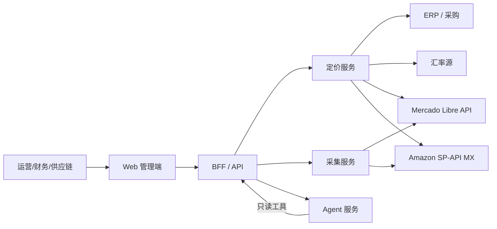
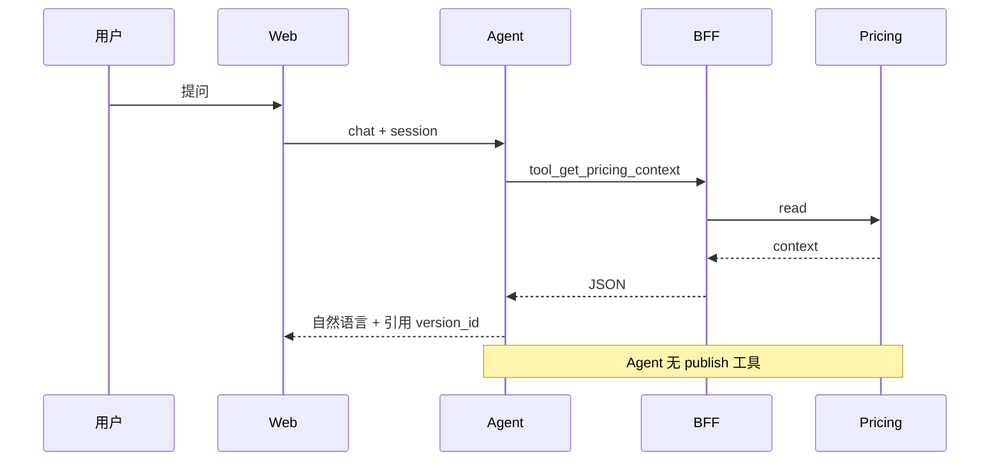

# 方案设计文档（SDD）：墨西哥跨境定价与调价工具

| 属性 | 内容 |
|------|------|
| 文档版本 | v1.0 |
| 关联 PRD | [PRD-mexico-cross-border-pricing.md](./PRD-mexico-cross-border-pricing.md) |
| 关联测试 | [test-cases.md](./test-cases.md) |
| 产品代号 | MX-Pricing |

---

## 1. 文档目的与读者

本文档在 PRD 基础上给出 **可研发落地** 的技术方案：服务边界、数据模型、核心算法、接口契约、异步与集成、安全及与 Agent 的隔离。测试验收以 [test-cases.md](./test-cases.md) 为准。

---

## 2. 系统上下文（C4 Context）



**外部依赖**

| 系统 | 用途 | 失败策略 |
|------|------|----------|
| Mercado Libre Developers API | Listing/价格读写、竞品 | 熔断该 shop-ML；不自动降价 |
| Amazon SP-API (MX) | Listing/价格/Buy Box | 同上，按 channel |
| 汇率 API / 手工表 | USD/CNY→MXN | 过期汇率禁止自动调价 |
| OIDC/SSO | 登录 | 拒绝访问 |
| 对象存储 | 导出 | 重试；不阻塞算价 |

---

## 3. 服务拆分与职责

| 服务 | 职责 | 存储 | 写 Active 价 |
|------|------|------|----------------|
| **bff-web** | 聚合、i18n 格式化、会话 | 无状态 | 否（调 pricing） |
| **svc-pricing** | 引擎、Guard、Version、调价单、规则 | PostgreSQL | 是（经 Guard） |
| **svc-catalog** | Product/SKU、Cost、Policy、Template | PostgreSQL | — |
| **svc-channel** | 店铺凭证、Listing 同步、通道适配器 | PostgreSQL + 密钥库 | 回写渠道 |
| **svc-competitor** | Offer、观测、Tier 调度、Stale | PostgreSQL + TS 观测 | 否 |
| **svc-repricing** | 事件消费、去抖、动态运行时 | Redis 去抖 + PG | 调 pricing |
| **svc-agent** | LLM、工具调用 | 无 DB 写 | **禁止** |
| **worker-export** | CSV/PDF | 对象存储 | 否 |

**部署建议（MVP）**：`svc-catalog` + `svc-pricing` 可合并为单进程模块化单体；`svc-channel`、`svc-competitor`、`svc-repricing` 在 P2 后独立 Worker；Agent 独立 Pod。

---

## 4. 多租户与隔离

- **Tenant**：集团/公司；数据行级 `tenant_id`。
- **Shop**：ML/Amazon 店铺，隶属 Tenant。
- **授权范围**：RBAC 绑定 `tenant_id` + 可选 `shop_id` + `channel` + 品类树。
- **凭证**：`shop_credentials` 加密（KMS/应用层 AES）；Agent 服务无凭证表读权限，仅 BFF 后端代理。

---

## 5. 数据模型（物理表设计摘要）

### 5.1 主数据

**`products`**：`id`, `tenant_id`, `name`, `category_id`, timestamps

**`skus`**：`id`, `product_id`, `sku_code`, `hs_code`, `weight_g`, `volume_cm3`, `status`

**`cost_sheets`**：`id`, `sku_id`, `batch_no`, `cogs_amount`, `cogs_currency`, `freight_alloc`, `effective_from`, `effective_to`, `source`

**`fx_rates`**：`id`, `base`, `quote` (MXN), `rate`, `buffer_pct`, `valid_from`, `valid_to`, `source`

**`tariff_rules`**：`hs_code`, `duty_rate`, `notes` (MVP 单率)

### 5.2 策略与模板

**`fee_templates`**：`id`, `tenant_id`, `channel`, `category_id`, `fulfillment_type`, `rules_json`（佣金%、固定费、支付%等）

**`pricing_policies`**：`id`, `tenant_id`, `name`, `pricing_mode` ENUM, `target_margin_pct`, `tax_strategy` ENUM, `rounding_rule` JSON, `min_margin_pct`

**`sku_policy_bindings`**：`sku_id`, `policy_id`, `overrides_json`

### 5.3 通道 Listing

**`shops`**：`id`, `tenant_id`, `channel`, `external_seller_id`, `name`

**`listings`**：`id`, `sku_id`, `shop_id`, `channel`, `external_item_id`, `external_asin`, `seller_sku`, `fulfillment_type`, `active_price_version_id`, `synced_at`

唯一约束：`(sku_id, channel)` 每 SKU 每通道最多一条。

### 5.4 竞品

**`competitor_offers`**：`id`, `listing_id`, `channel`, `external_ref`, `seller_id`, `label`, `is_primary`

**`price_observations`**：`id`, `offer_id`, `observed_at`, `list_price`, `sale_price`, `shipping_addon`, `effective_price`, `currency`, `raw_json`

索引：`(offer_id, observed_at DESC)`

### 5.5 定价版本（不可变）

**`price_versions`**：`id`, `listing_id`, `channel`, `sku_id`, `state` ENUM(suggested|pending|active|superseded), `pricing_mode`, `publish_price_mxn`, `floor_price_mxn`, `match_price_mxn`, `margin_pct`, `waterfall_json`, `cost_snapshot_id`, `floor_snapshot_id`, `competitor_snapshot_ids` UUID[], `trigger_event_id`, `dynamic_rule_id`, `parent_version_id`, `created_by`, `created_at`

规则：**禁止 UPDATE** `waterfall_json` / 价格字段；仅允许 `state` 迁移（如 active→superseded）。

**`waterfall_lines`**（可选规范化）：或仅存 `waterfall_json`；若规范化则 `version_id`, `sort_order`, `layer_id`, `calc_type`, `amount`, `rate`, `source`, `meta_json`

### 5.6 调价与动态规则

**`adjustment_batches`**：`id`, `tenant_id`, `status`, `reason_code`, `created_by`, `approved_by`, `applied_at`

**`adjustment_items`**：`batch_id`, `listing_id`, `from_version_id`, `to_version_id`, `guard_result`

**`dynamic_repricing_rules`**：`id`, `listing_id`, `enabled`, `action` ENUM, `anchor_type`, `offset_json`, `triggers_json`, `cooldown_min`, `daily_limit`, `min_gap_mxn`, `tier`, `frozen` BOOL

**`repricing_events`**：`id`, `listing_id`, `channel`, `type`, `payload_json`, `processed_at`, `dedupe_key`

### 5.7 审计

**`audit_logs`**：`tenant_id`, `actor_id`, `action`, `entity_type`, `entity_id`, `diff_json`, `at`

---

## 6. 定价引擎设计

### 6.1 输入：`PricingContext`

```text
PricingContext {
  sku, listing?, channel?,
  policy, fee_template,
  cost_sheet, fx_rate, tariff,
  competitor_snapshots[]?,  // 竞争模式
  manual_competitor_price?, // MVP
  simulation?: { target_margin | target_price }
}
```

### 6.2 到岸成本（Landed Cost）

```text
cogs_mxn = cogs * fx(cogs_currency→MXN) * (1 + fx_buffer)
landed = cogs_mxn + freight_alloc_mxn + duty(cogs_mxn) + customs_fee
```

`duty` MVP：`cogs_mxn * tariff_rate`。

### 6.3 分通道 Floor（盈亏平衡标价）

自下而上求 `floor_channel`：给定 `landed` 与 `fee_template`，求满足 `min_margin_pct` 的最小 **含税标价** `P`：

```text
net(P) = P - channel_fees(P) - fulfillment_fees
margin = (net(P) - landed) / P
求最小 P 使得 margin >= min_margin_pct
```

`channel_fees` 含售价%佣金、固定费；迭代或闭式近似（实现时用二分搜索保证单调）。

### 6.4 成本定价（正向）

```text
base_net_target = landed / (1 - target_margin_pct - fee_rate_on_price)
P = apply_tax_and_round(base_net_target, tax_strategy, rounding_rule)
```

瀑布逐层展开各项费用（与 PRD 层枚举一致）。

### 6.5 竞争定价

```text
anchor_price = aggregate(competitor_snapshots, anchor_type)  // min|median|buy_box
match_price = apply_offset(anchor_price, offset)
raw_publish = max(match_price, floor_channel)
publish_price = round_tax(raw_publish)
```

**`competitive_with_floor`**：若 `match_price < floor`，瀑布层 `LAYER_FLOOR_BINDING` 标记原因 `FLOOR_LIFT`。

### 6.6 反向模拟

输入 `target_price` 或 `target_margin`：反推 `implied_margin` 或 `max_cogs`；不改变已发布 Version。

### 6.7 Guard 链（责任链）

顺序执行，任一失败返回 `GuardCode`：

1. `NEGATIVE_MARGIN` — publish 后毛利 < 0  
2. `BELOW_MIN_MARGIN` — < policy.min_margin_pct  
3. `BELOW_FLOOR` — 竞争模式不允许（应被 max 消化，双检）  
4. `ABOVE_CEILING` — MAP  
5. `COOLDOWN_ACTIVE` — 动态调价  
6. `DAILY_LIMIT_EXCEEDED`  
7. `STALE_COMPETITOR_DATA` — 自动调价路径  
8. `CHANNEL_FROZEN` — 熔断  
9. `APPROVAL_REQUIRED` — 人工审批档位  

---

## 7. 瀑布层枚举（`layer_id`）

| layer_id | 成本模式 | 竞争模式 | 说明 |
|----------|----------|----------|------|
| `COGS` | ✓ | 对照 | 采购折 MXN |
| `FREIGHT_INTL` | ✓ | — | 头程 |
| `DUTY` | ✓ | — | 关税 |
| `CUSTOMS` | ✓ | — | 清关 |
| `LANDED` | ✓ | 对照 | 小计 |
| `FULFILLMENT` | ✓ | ✓ | FBA/ML Full/尾程 |
| `COMMISSION` | ✓ | ✓ | 平台佣金 |
| `PAYMENT_FEE` | ✓ | ✓ | 支付（ML） |
| `MARKETING_ALLOC` | 可选 | 可选 | 广告分摊 |
| `TARGET_PROFIT` | ✓ | — | 成本模式利润层 |
| `COMPETITOR_ANCHOR` | — | ✓ | 锚点价 |
| `COMPETITOR_OFFSET` | — | ✓ | 策略偏移 |
| `MATCH_PRICE` | — | ✓ | 对标价 |
| `FLOOR_BINDING` | — | ✓ | 兜底抬价 |
| `IVA_DISPLAY` | ✓ | ✓ | 税展示 |
| `LIST_PRICE` | ✓ | ✓ | 标价 |
| `NET_PROCEEDS` | ✓ | ✓ | 预计净入 |
| `CONTRIBUTION_MARGIN` | ✓ | ✓ | 贡献毛利 |

`WaterfallBuilder` 根据 `pricing_mode` 与 `channel` 选择层序列；缺失数据层 `source=missing` 并阻断自动发布。

---

## 8. 竞品采集与事件管道

### 8.1 调度

- Cron + 延迟队列：`tier`→间隔映射 T0=15m, T1=1h, T2=24h。  
- 每 `listing_id` 维护 `next_run_at`；令牌桶按 `shop_id` 限流。

### 8.2 归一化

```text
effective = sale_price ?? list_price
if include_shipping: effective += shipping_addon
```

Amazon：`anchor_type=buy_box` 时使用 Buy Box 观测记录。

### 8.3 事件

**`CompetitorPriceChanged`** payload：

```json
{
  "listing_id": "uuid",
  "channel": "MERCADO_LIBRE",
  "offer_id": "uuid",
  "previous_effective": 499.0,
  "current_effective": 449.0,
  "observed_at": "ISO8601",
  "observation_id": "uuid"
}
```

### 8.4 去抖

Redis key `dedupe:{listing_id}` TTL=300s；窗口内仅保留首尾或最大 delta 事件（配置 `debounce_strategy`）。

### 8.5 动态运行时

```text
on event:
  if listing.frozen or rule.frozen: log skip
  if stale(observations): emit alert only
  ctx = build PricingContext with latest snapshots
  result = engine.competitive(ctx)
  guard = run guards for action tier
  if pass: create PriceVersion(state=suggested|pending|active per rule)
  if active: channel_adapter.publish(listing, version)
  on publish fail: set rule.frozen=true, alert
```

---

## 9. 通道适配器

### 9.1 接口（内部）

```text
ChannelAdapter {
  pullListing(shop, ref) -> ListingSnapshot
  pullCompetitorPrices(shop, offers[]) -> Observation[]
  publishPrice(shop, listing, price_mxn, meta) -> PublishResult
}
```

实现：`MercadoLibreAdapter`, `AmazonMxSpApiAdapter`。

### 9.2 错误映射

| 外部错误 | 内部码 | 动作 |
|----------|--------|------|
| 429 | `RATE_LIMIT` | 退避重试 |
| 价格无效步长 | `INVALID_PRICE_STEP` | 学习步长表 |
| 401 | `AUTH_EXPIRED` | 标记 shop 需重新授权 |
| 5xx | `CHANNEL_UNAVAILABLE` | 不熔断首次；连续 N 次熔断 |

### 9.3 部分成功

`PublishBatchResult` 按 listing 记录；Version 上 `publish_status` per channel：`published|failed|skipped`。

---

## 10. API 设计（BFF 对外，REST）

**约定**：`Authorization: Bearer`；`Accept-Language`；`X-Tenant-Id`（或由 token 解析）；分页 `cursor`。

### 10.1 定价上下文（核心）

`GET /api/v1/skus/{skuId}/pricing-context?channel=MERCADO_LIBRE`

响应含：sku、listings[]、policy、active/suggested versions、floor_ml/floor_amazon、competitor series 摘要、formatted 金额字段。

### 10.2 模拟

`POST /api/v1/skus/{skuId}/pricing/simulate`

Body：`channel`, `pricing_mode`, `target_margin_pct` | `target_price_mxn`, `competitor_price_mxn?`  
响应：`waterfall`, `publish_price_mxn`, `guards[]`（不落库）。

### 10.3 发布 Version

`POST /api/v1/listings/{listingId}/price-versions`

Body：`from_simulation_token` 或 `explicit_price_mxn` + `reason`  
经 Guard → 返回 `version_id`, `state`。

### 10.4 调价单

`POST /api/v1/adjustment-batches`  
`POST /api/v1/adjustment-batches/{id}/approve`  
`POST /api/v1/adjustment-batches/{id}/apply`

### 10.5 动态规则

`PUT /api/v1/listings/{listingId}/dynamic-repricing-rule`  
`POST /api/v1/listings/{listingId}/dynamic-repricing-rule/unfreeze`

### 10.6 竞品

`GET /api/v1/listings/{listingId}/competitors`  
`POST /api/v1/listings/{listingId}/competitors`  
`GET /api/v1/listings/{listingId}/price-history?range=7d`

### 10.7 Agent 工具（内部 gRPC/REST，仅 svc-agent 可调）

- `tool_get_pricing_context`  
- `tool_list_price_versions`  
- `tool_simulate`（只读）  
- `tool_create_adjustment_draft`（写 draft batch，无 apply）  
- **无** `tool_publish_price`

---

## 11. 前端架构

- **框架**：React/Next 或 Vue3 + TS（团队选型）。  
- **状态**：React Query 拉取 pricing-context；模拟结果短期缓存。  
- **瀑布组件**：纯展示 `waterfall.lines`；模拟杆调 API simulate。  
- **双列布局**：`ListingPanel[channel=ML|AMAZON_MX]` 共享 SKU 头。  
- **i18n**：`react-i18next`；金额用 API 返回的 `formatted` + 原始 `amount` 供 Copilot。

---

## 12. Agent 混合架构



**策略编译器**：LLM 输出 JSON Schema 约束的 `DynamicRuleDraft` → 前端表单确认 → `PUT` 正式规则。

---

## 13. 非功能实现要点

| 项 | 方案 |
|----|------|
| 性能 | pricing-context 缓存 60s；观测时序单独查；批量重算走队列 |
| 一致性 | Version 创建与 listing.active_version 更新同事务 |
| 幂等 | `repricing_events.dedupe_key`；publish 带 `idempotency_key` |
| 可观测 | 指标：`pricing_calc_duration`, `repricing_lag`, `publish_fail_rate` |
| 安全 | OWASP；渠道 token 轮换；Agent 网络策略仅允许访问 BFF |

---

## 14. 与 PRD 待决策的默认实现假设（SDD 假设）

研发默认按以下实现，PRD 变更时同步修订 SDD：

1. **含税标价**：`tax_strategy=PRICE_INCLUDES_IVA`（墨西哥前台常见）。  
2. **毛利口径**：贡献毛利基于 **landed cost**；COGS 仅作瀑布展示层。  
3. **促销价**：独立 `promo_waterfall` 字段，不覆盖主 `LIST_PRICE` Version。  
4. **Amazon Auto**：仅 `dynamic_rule.auto_active` 且 SKU 在白名单表。  

---

## 15. 目录与代码结构（建议）

```text
/apps/web
/apps/bff
/services/pricing
/services/channel
/services/competitor
/services/repricing
/services/agent
/packages/pricing-engine    # 纯函数，无 IO
/packages/channel-adapters
/packages/i18n-format
/tests/golden               # 对齐 test-cases 与 TC 编号
/tests/contract
/tests/e2e
/docs                       # PRD, SDD, test-cases, task-list
```

---

## 16. 变更记录

| 版本 | 日期 | 说明 |
|------|------|------|
| v1.0 | 2026-07-20 | 初版，对齐 PRD v1.0 |
